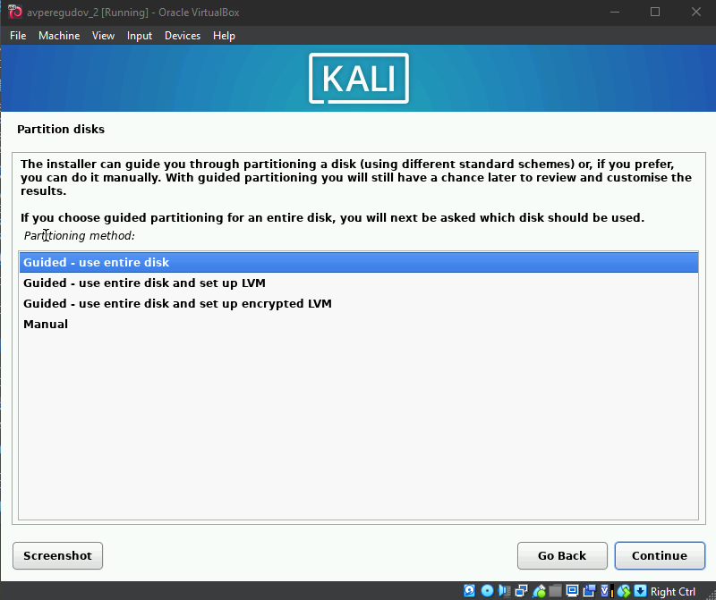

---
## Front matter
title: "Индивидуальный проект. Часть 1"
subtitle: "Основы информационной безопасности"
author: "Перегудов Александр Вадимович"

## Generic otions
lang: ru-RU
toc-title: "Содержание"

## Bibliography
bibliography: bib/cite.bib
csl: pandoc/csl/gost-r-7-0-5-2008-numeric.csl

## Pdf output format
toc: true # Table of contents
toc-depth: 2
lof: true # List of figures
lot: true # List of tables
fontsize: 12pt
linestretch: 1.5
papersize: a4
documentclass: scrreprt
## I18n polyglossia
polyglossia-lang:
  name: russian
  options:
	- spelling=modern
	- babelshorthands=true
polyglossia-otherlangs:
  name: english
## I18n babel
babel-lang: russian
babel-otherlangs: english
## Fonts
mainfont: PT Serif
romanfont: PT Serif
sansfont: PT Sans
monofont: PT Mono
mainfontoptions: Ligatures=TeX
romanfontoptions: Ligatures=TeX
sansfontoptions: Ligatures=TeX,Scale=MatchLowercase
monofontoptions: Scale=MatchLowercase,Scale=0.9
## Biblatex
biblatex: true
biblio-style: "gost-numeric"
biblatexoptions:
  - parentracker=true
  - backend=biber
  - hyperref=auto
  - language=auto
  - autolang=other*
  - citestyle=gost-numeric
## Pandoc-crossref LaTeX customization
figureTitle: "Рис."
tableTitle: "Таблица"
listingTitle: "Листинг"
lofTitle: "Список иллюстраций"
lotTitle: "Список таблиц"
lolTitle: "Листинги"
## Misc options
indent: true
header-includes:
  - \usepackage{indentfirst}
  - \usepackage{float} # keep figures where there are in the text
  - \floatplacement{figure}{H} # keep figures where there are in the text
---

# Цель работы

Целью данной работы является приобретение практических навыков
установки операционной системы на виртуальную машину

# Задание

# Теоретическое введение

# Выполнение лабораторной работы

Задаю имя и образ виртуальной машины. (рис. @fig:001)

{#fig:001 width=70%}

Задаю выделяюмую память и потоки. (рис. @fig:002)

{#fig:002 width=70%}

Задаю размер жёсткого диска. (рис. @fig:003)

{#fig:003 width=70%}

Смотрю итоги конфигурации и заканчиваю первые настройки. (рис. @fig:004)

{#fig:004 width=70%}

Запускаю установщик и выбираю локацию. (рис. @fig:005, @fig:006)

{#fig:005 width=70%}

{#fig:006 width=70%}

Выбираю раскладку. (рис. @fig:007)

{#fig:007 width=70%}

Задаю имя домена. (рис. @fig:008)

{#fig:008 width=70%}

Задаю полное имя для первой учётной записи. (рис. @fig:009)

{#fig:009 width=70%}

Задаю сокращённое имя для первой учётной записи. (рис. @fig:010)

{#fig:010 width=70%}

Задаю пароль для первой учётной записи (рис. @fig:011)

{#fig:011 width=70%}

Выбрал часовой пояс. (рис. @fig:012)

{#fig:012 width=70%}

Делю весь диск по умолчанию. (рис. @fig:013)

{#fig:013 width=70%}

Подтверждаю свой выбор. (рис. @fig:014)

{#fig:014 width=70%}

Выбираю опцию при которой все файлы будут на одном логическом разделе диска. (рис. @fig:015)

{#fig:015 width=70%}

Смотрю конечную конфигурацию и подтверждаю выбор. (рис. @fig:016, @fig:017)

{#fig:016 width=70%}

[Подтверждение](image/17.png){#fig:017 width=70%}

Установка. (рис. @fig:018)

{#fig:018 width=70%}

Выбираю стандартный набор приложений. (рис. @fig:019)

{#fig:019 width=70%}

Установил наборы приложений. (рис. @fig:020)

{#fig:020 width=70%}

Устанавливаю загрузчик на диск с системой. (рис. @fig:021, @fig:022)

{#fig:021 width=70%}

{#fig:022 width=70%}

Запускаю установку загрузчика. (рис. @fig:023)

{#fig:023 width=70%}

Заканчиваю установку ОС и перехагружаю виртуальную машину. (рис. @fig:024)

{#fig:024 width=70%}

Вхожу в систему под своей учётной записью. (рис. @fig:025)

{#fig:025 width=70%}

Установка завершена. (рис. @fig:026)

{#fig:026 width=70%}

# Выводы

В данной лаборатной работе были приобретены практические навыки по установке операционной системы.

# Список литературы{.unnumbered}

::: {#refs}
:::
