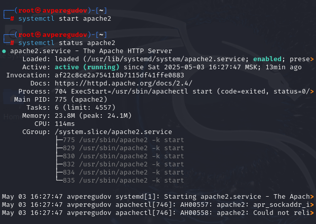
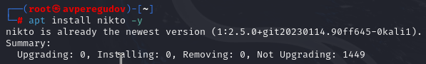
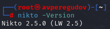
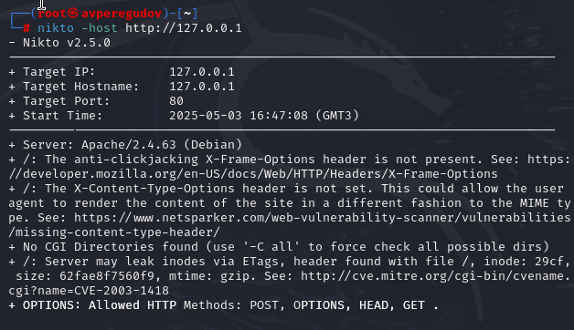
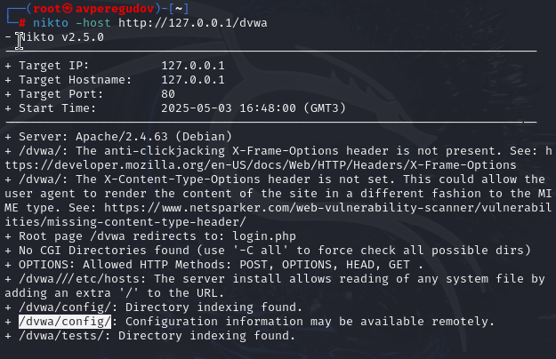
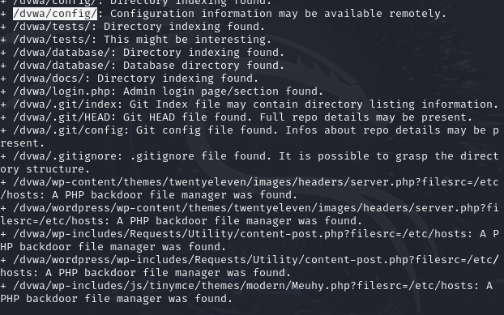
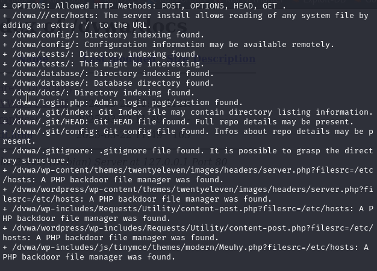
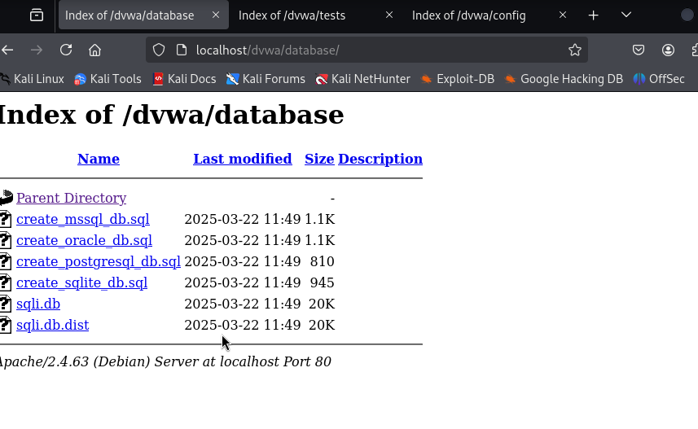
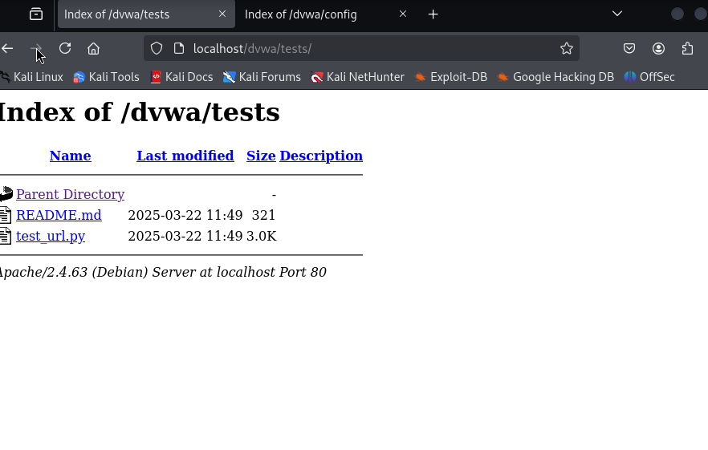
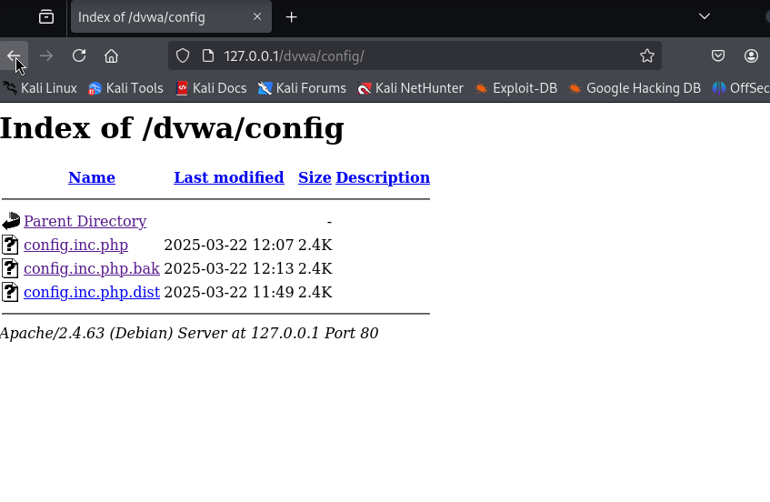

---
## Front matter
title: "Индивидуальный проект. Часть 4"
subtitle: "Основы информационной безопасности"
author: "Перегудов Александр Вадимович"

## Generic otions
lang: ru-RU
toc-title: "Содержание"

## Bibliography
bibliography: bib/cite.bib
csl: pandoc/csl/gost-r-7-0-5-2008-numeric.csl

## Pdf output format
toc: true # Table of contents
toc-depth: 2
lof: true # List of figures
lot: true # List of tables
fontsize: 12pt
linestretch: 1.5
papersize: a4
documentclass: scrreprt
## I18n polyglossia
polyglossia-lang:
  name: russian
  options:
	- spelling=modern
	- babelshorthands=true
polyglossia-otherlangs:
  name: english
## I18n babel
babel-lang: russian
babel-otherlangs: english
## Fonts
mainfont: PT Serif
romanfont: PT Serif
sansfont: PT Sans
monofont: PT Mono
mainfontoptions: Ligatures=TeX
romanfontoptions: Ligatures=TeX
sansfontoptions: Ligatures=TeX,Scale=MatchLowercase
monofontoptions: Scale=MatchLowercase,Scale=0.9
## Biblatex
biblatex: true
biblio-style: "gost-numeric"
biblatexoptions:
  - parentracker=true
  - backend=biber
  - hyperref=auto
  - language=auto
  - autolang=other*
  - citestyle=gost-numeric
## Pandoc-crossref LaTeX customization
figureTitle: "Рис."
tableTitle: "Таблица"
listingTitle: "Листинг"
lofTitle: "Список иллюстраций"
lotTitle: "Список таблиц"
lolTitle: "Листинги"
## Misc options
indent: true
header-includes:
  - \usepackage{indentfirst}
  - \usepackage{float} # keep figures where there are in the text
  - \floatplacement{figure}{H} # keep figures where there are in the text
---

# Цель работы

Целью данной работы - приобретение навыков по использованию nikto.

# Задание

# Теоретическое введение

# Выполнение лабораторной работы

Запустил apache для работы сайта DVWA. (рис. @fig:001)

{#fig:001 width=70%}

Проверил обновления nikto. (рис. @fig:002)

{#fig:002 width=70%}

Проверил версию nikto. (рис. @fig:003)

{#fig:003 width=70%}

Просканировал свою машину. (рис. @fig:004)

{#fig:004 width=70%}

Просканировал сайт на своей машине. (рис. @fig:005, @fig:006, @fig:007)

{#fig:005 width=70%}

{#fig:006 width=70%}

{#fig:007 width=70%}

nikto нашёл некоторые уязвимости (backdoors). Если воспользоваться информацией nikto, то можно получить доступ к файловому менеджеру, что в свою очередь даёт полный контроль над сайтом. Также перейдя по некоторым ссылкам, полученных с помощью nikto, Можно сразу же просмотреть файлы на сервере. (рис. @fig:008, @fig:009, @fig:010)

{#fig:008 width=70%}

{#fig:009 width=70%}

{#fig:010 width=70%}

# Выводы

В данной лаборатной работе были приобретены практические навыки по использованию nikto.

# Список литературы{.unnumbered}

::: {#refs}
:::
