---
## Front matter
lang: ru-RU
title: Лабораторная работа № 5
subtitle: Операционные системы
author:
  - Перегудов А.В.
institute:
  - Российский университет дружбы народов, Москва, Россия
date: 16 марта 2024

## i18n babel
babel-lang: russian
babel-otherlangs: english

## Fonts
mainfont: PT Serif
romanfont: PT Serif
sansfont: PT Sans
monofont: PT Mono
mainfontoptions: Ligatures=TeX
romanfontoptions: Ligatures=TeX
sansfontoptions: Ligatures=TeX,Scale=MatchLowercase
monofontoptions: Scale=MatchLowercase,Scale=0.9

## Formatting pdf
toc: false
toc-title: Содержание
slide_level: 2
aspectratio: 169
section-titles: true
theme: metropolis
header-includes:
 - \metroset{progressbar=frametitle,sectionpage=progressbar,numbering=fraction}
 - '\makeatletter'
 - '\beamer@ignorenonframefalse'
 - '\makeatother'
---

# Информация

## Докладчик

  * Перегудов Александр Вадимович
  * Студент группы НКАбд-04-23
  * Российский университет дружбы народов
  * [1132239659@pfur.ru]
  * <https://github.com/magister6239/study_2023-2024_os-intro>

# Вводная часть

Настройка рабочей среды.

## Актуальность

- Современные проекты требуют гибкой конфигурации, которая может изменяться в зависимости от среды разработки или выполнения. Использование chezmoi позволяет эффективно управлять конфигурациями на разных уровнях
- Безопасное хранение и обмен паролями – важная задача в сфере информационной безопасности. Утилиты pass и gopass предоставляют удобный и безопасный способ управления паролями

## Объект и предмет исследования

- chezmoi
- pass
- gopass

## Цели и задачи

Получение навыков работы с chezmoi, pass, gopass. Облегчение последующей работы с git.

## Материалы и методы

- Процессор `pandoc` для входного формата Markdown
- Результирующие форматы
	- `pdf`
	- `html`
- Автоматизация процесса создания: `Makefile`

## Установка pass и gopass

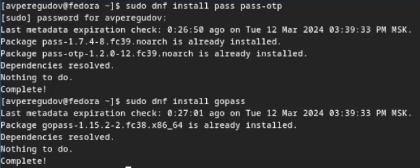{width=70%}

## Ключи gpg

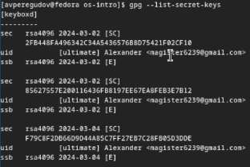{width=70%}

## Настройка

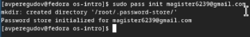{width=70%}

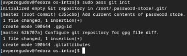{width=70%}

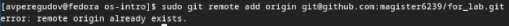{width=70%}

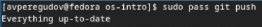{width=70%}

## Настройка интерфейса с броузером

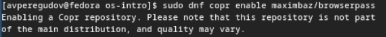{width=70%}

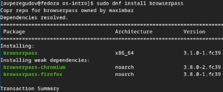{width=70%}

## Сохранение пароля

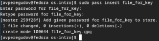{width=70%}

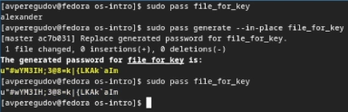{width=70%}

## Дополнительное программное обеспечение

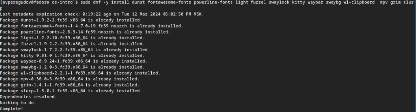{width=70%}

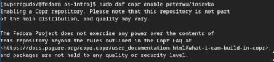{width=70%}

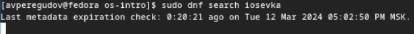{width=70%}

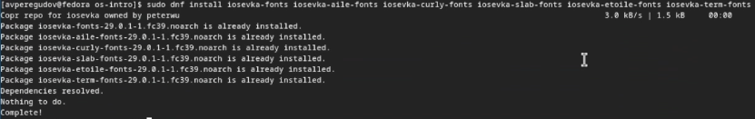{width=70%}

## Установка

{width=70%}

## Создание собственного репозитория с помощью утилит

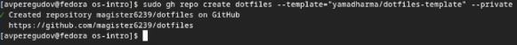{width=70%}

## Подключение репозитория к своей системе

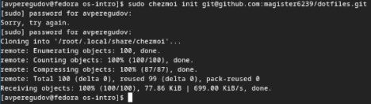{width=70%}

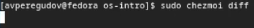{width=70%}

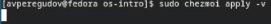{width=70%}

## Использование chezmoi на нескольких машинах

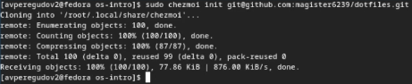{width=70%}

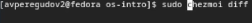{width=70%}

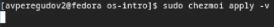{width=70%}

## Ежедневные операции c chezmoi

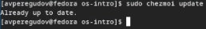{width=70%}

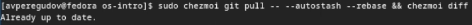{width=70%}

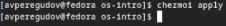{width=70%}

Автоматическая фиксация и отправка изменений в репозиторий

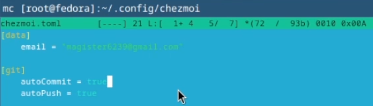{width=70%}
