---
## Front matter
title: "Лабораторная работа № 5"
subtitle: "Операционные системы"
author: "Перегудов Александр Вадимович"

## Generic otions
lang: ru-RU
toc-title: "Содержание"

## Bibliography
bibliography: bib/cite.bib
csl: pandoc/csl/gost-r-7-0-5-2008-numeric.csl

## Pdf output format
toc: true # Table of contents
toc-depth: 2
lof: true # List of figures
lot: true # List of tables
fontsize: 12pt
linestretch: 1.5
papersize: a4
documentclass: scrreprt
## I18n polyglossia
polyglossia-lang:
  name: russian
  options:
	- spelling=modern
	- babelshorthands=true
polyglossia-otherlangs:
  name: english
## I18n babel
babel-lang: russian
babel-otherlangs: english
## Fonts
mainfont: PT Serif
romanfont: PT Serif
sansfont: PT Sans
monofont: PT Mono
mainfontoptions: Ligatures=TeX
romanfontoptions: Ligatures=TeX
sansfontoptions: Ligatures=TeX,Scale=MatchLowercase
monofontoptions: Scale=MatchLowercase,Scale=0.9
## Biblatex
biblatex: true
biblio-style: "gost-numeric"
biblatexoptions:
  - parentracker=true
  - backend=biber
  - hyperref=auto
  - language=auto
  - autolang=other*
  - citestyle=gost-numeric
## Pandoc-crossref LaTeX customization
figureTitle: "Рис."
tableTitle: "Таблица"
listingTitle: "Листинг"
lofTitle: "Список иллюстраций"
lotTitle: "Список таблиц"
lolTitle: "Листинги"
## Misc options
indent: true
header-includes:
  - \usepackage{indentfirst}
  - \usepackage{float} # keep figures where there are in the text
  - \floatplacement{figure}{H} # keep figures where there are in the text
---

# Цель работы

Получение навыков работы с chezmoi, pass, gopass. Облегчение последующей работы с git.

# Задание

# Теоретическое введение

: Описание некоторых каталогов файловой системы GNU Linux {#tbl:std-dir}

| Имя каталога | Описание каталога                                                                                                          |
|--------------|----------------------------------------------------------------------------------------------------------------------------|
| `/`          | Корневая директория, содержащая всю файловую                                                                               |
| `/bin `      | Основные системные утилиты, необходимые как в однопользовательском режиме, так и при обычной работе всем пользователям     |
| `/etc`       | Общесистемные конфигурационные файлы и файлы конфигурации установленных программ                                           |
| `/home`      | Содержит домашние директории пользователей, которые, в свою очередь, содержат персональные настройки и данные пользователя |
| `/media`     | Точки монтирования для сменных носителей                                                                                   |
| `/root`      | Домашняя директория пользователя  `root`                                                                                   |
| `/tmp`       | Временные файлы                                                                                                            |
| `/usr`       | Вторичная иерархия для данных пользователя                                                                                 |

Более подробно про Unix см. в [@tanenbaum_book_modern-os_ru; @robbins_book_bash_en; @zarrelli_book_mastering-bash_en; @newham_book_learning-bash_en].

# Выполнение лабораторной работы

Установка pass и gopass. (рис. @fig:001)

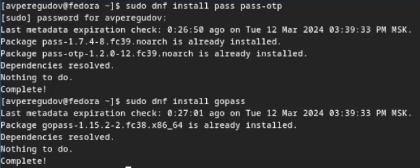{#fig:001 width=70%}

Просмотр списка ключей. (рис. @fig:002)

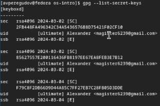{#fig:002 width=70%}

Инициализация хранилища. (рис. @fig:003)

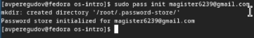{#fig:003 width=70%}

Создание структуры git. (рис. @fig:004)

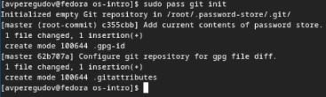{#fig:004 width=70%}

Задание адреса репозитория на github. (рис. @fig:005)

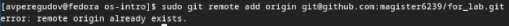{#fig:005 width=70%}

Синхронизация локального и удалённого репозитория. (рис. @fig:006)

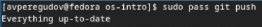{#fig:006 width=70%}

Задание адреса репозитория на github. (рис. @fig:007)

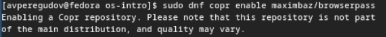{#fig:007 width=70%}

Установка browserpass. (рис. @fig:008)

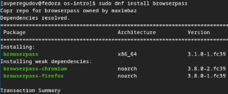{#fig:008 width=70%}

Добавление нового пароля. (рис. @fig:009)

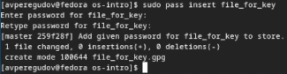{#fig:009 width=70%}

Изменение пароля и вывод его на экран. (рис. @fig:010)

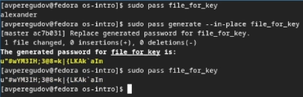{#fig:010 width=70%}

Установка дополнительного программного обеспечения. (рис. @fig:011)

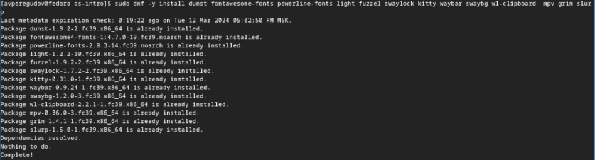{#fig:011 width=70%}

Включение репозитория Copr. (рис. @fig:012)

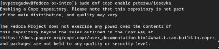{#fig:012 width=70%}

Поиск пакетов связанных со шрифтом iosevka. (рис. @fig:013)

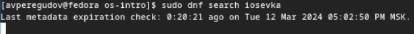{#fig:013 width=70%}

Установка шрифтов. (рис. @fig:014)

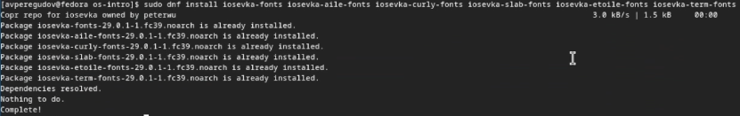{#fig:014 width=70%}

Установка бинарного файла. (рис. @fig:015)

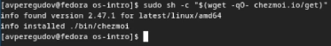{#fig:015 width=70%}

Создание репозитория для конфигурационных файлов на основе шаблона. (рис. @fig:016)

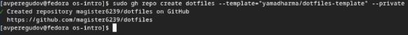{#fig:016 width=70%}

Инициализация chezmoi с моим репозиторием dotfiles. (рис. @fig:017)

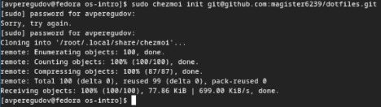{#fig:017 width=70%}

Проверка изменений chezmoi. (рис. @fig:018)

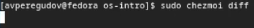{#fig:018 width=70%}

Приминение изменений внесённых chezmoi. (рис. @fig:019)

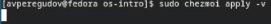{#fig:019 width=70%}

Инициализация chezmoi с моим репозиторием dotfiles на второй машине. (рис. @fig:020)

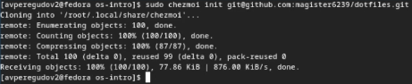{#fig:020 width=70%}

Проверка изменений chezmoi. (рис. @fig:021)

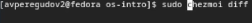{#fig:021 width=70%}

Приминение изменений внесённых chezmoi. (рис. @fig:022)

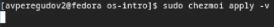{#fig:022 width=70%}

Извлечение последних изменений из репозитория и их приминение. (рис. @fig:023)

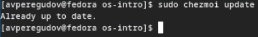{#fig:023 width=70%}

Извлечение последних изменений из репозитория и просмотр изменений без применений изменений. (рис. @fig:024)

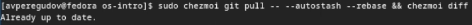{#fig:024 width=70%}

Приминение изменений. (рис. @fig:025)

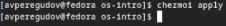{#fig:025 width=70%}

Изменил файл конфигурации chezmoi ~/.config/chezmoi/chezmoi.toml для автоматической фиксации и отправки изменений в репозиторий (рис. @fig:026)

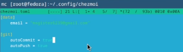{#fig:026 width=70%}

# Выводы

Были полученны навыки работы с chezmoi, pass, gopass.

# Список литературы{.unnumbered}

::: {#refs}
:::
