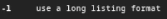
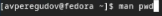
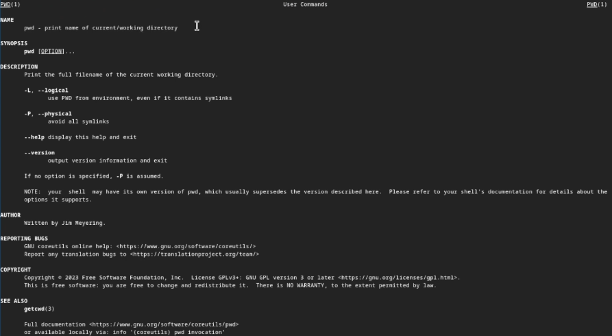

---
## Front matter
title: "Лабораторная работа № 6"
subtitle: "Операционные системы"
author: "Перегудов Александр Вадимович"

## Generic otions
lang: ru-RU
toc-title: "Содержание"

## Bibliography
bibliography: bib/cite.bib
csl: pandoc/csl/gost-r-7-0-5-2008-numeric.csl

## Pdf output format
toc: true # Table of contents
toc-depth: 2
lof: true # List of figures
lot: true # List of tables
fontsize: 12pt
linestretch: 1.5
papersize: a4
documentclass: scrreprt
## I18n polyglossia
polyglossia-lang:
  name: russian
  options:
	- spelling=modern
	- babelshorthands=true
polyglossia-otherlangs:
  name: english
## I18n babel
babel-lang: russian
babel-otherlangs: english
## Fonts
mainfont: PT Serif
romanfont: PT Serif
sansfont: PT Sans
monofont: PT Mono
mainfontoptions: Ligatures=TeX
romanfontoptions: Ligatures=TeX
sansfontoptions: Ligatures=TeX,Scale=MatchLowercase
monofontoptions: Scale=MatchLowercase,Scale=0.9
## Biblatex
biblatex: true
biblio-style: "gost-numeric"
biblatexoptions:
  - parentracker=true
  - backend=biber
  - hyperref=auto
  - language=auto
  - autolang=other*
  - citestyle=gost-numeric
## Pandoc-crossref LaTeX customization
figureTitle: "Рис."
tableTitle: "Таблица"
listingTitle: "Листинг"
lofTitle: "Список иллюстраций"
lotTitle: "Список таблиц"
lolTitle: "Листинги"
## Misc options
indent: true
header-includes:
  - \usepackage{indentfirst}
  - \usepackage{float} # keep figures where there are in the text
  - \floatplacement{figure}{H} # keep figures where there are in the text
---

# Цель работы

Приобретение практических навыков взаимодействия пользователя с системой посредством командной строки.

# Задание

# Теоретическое введение

: Описание некоторых каталогов файловой системы GNU Linux {#tbl:std-dir}

| Имя каталога | Описание каталога                                                                                                          |
|--------------|----------------------------------------------------------------------------------------------------------------------------|
| `/`          | Корневая директория, содержащая всю файловую                                                                               |
| `/bin `      | Основные системные утилиты, необходимые как в однопользовательском режиме, так и при обычной работе всем пользователям     |
| `/etc`       | Общесистемные конфигурационные файлы и файлы конфигурации установленных программ                                           |
| `/home`      | Содержит домашние директории пользователей, которые, в свою очередь, содержат персональные настройки и данные пользователя |
| `/media`     | Точки монтирования для сменных носителей                                                                                   |
| `/root`      | Домашняя директория пользователя  `root`                                                                                   |
| `/tmp`       | Временные файлы                                                                                                            |
| `/usr`       | Вторичная иерархия для данных пользователя                                                                                 |

Более подробно про Unix см. в [@tanenbaum_book_modern-os_ru; @robbins_book_bash_en; @zarrelli_book_mastering-bash_en; @newham_book_learning-bash_en].

# Выполнение лабораторной работы

Вывел имя моего домашнего каталога. (рис. @fig:001)

{#fig:001 width=70%}

Перешёл в каталог tmp и вывел содержимое этого каталога. (рис. @fig:002)

{#fig:002 width=70%}

Использовал параметр -a. (рис. @fig:003)

{#fig:003 width=70%}

Использовал параметр -l. (рис. @fig:004)

{#fig:004 width=70%}

Использовал параметр -t. (рис. @fig:005)

{#fig:005 width=70%}

Использовал параметры -rt. (рис. @fig:006)

{#fig:006 width=70%}

В каталоге /var/spool нашёл подкаталог с именем cron. (рис. @fig:007)

{#fig:007 width=70%}

Перешёл в домашний каталог, вывел на экран его содержимое и определил, кто является владельцем файлов и подкаталогов. (рис. @fig:008)

{#fig:008 width=70%}

В домашнем каталоге создал каталог с именем newdir. (рис. @fig:009)

{#fig:009 width=70%}

В каталоге ~/newdir создал каталог с именем morefun. (рис. @fig:010)

{#fig:010 width=70%}

В домашнем каталоге создал одной командой три новых каталога с именами letters, memos, misk. (рис. @fig:011)

{#fig:011 width=70%}

Удалил эти каталоги одной командой. (рис. @fig:012)

{#fig:012 width=70%}

Попробовал удалить ранее созданный каталог ~/newdir командой rm и проверил был ли каталог удалён. (рис. @fig:013)

{#fig:013 width=70%}

Удалил каталог ~/newdir/morefun из домашнего каталога и проверил был ли каталог удалён. (рис. @fig:014)

{#fig:014 width=70%}

Использовал команду man. (рис. @fig:015)

{#fig:015 width=70%}

Нашёл опцию команды ls которую нужно использовать для просмотра содержимого указанного каталога и подкаталогов, входящих в него. (рис. @fig:016)

{#fig:016 width=70%}

Использовал команду ls с параметром -R. (рис. @fig:017)

{#fig:017 width=70%}

Использовал команду man. (рис. @fig:018)

{#fig:018 width=70%}

Нашёл опцию -l команды ls. (рис. @fig:019)

{#fig:019 width=70%}

Нашёл опцию -t команды ls. (рис. @fig:020)

{#fig:020 width=70%}

Использовал команду ls с параметрами -lt. (рис. @fig:021)

{#fig:021 width=70%}

Использовал команду man cd. (рис. @fig:022, @fig:023)

{#fig:022 width=70%}

{#fig:023 width=70%}

Использовал команду man cd. (рис. @fig:024, @fig:025)

{#fig:024 width=70%}

{#fig:025 width=70%}

Использовал команду man cd. (рис. @fig:026, @fig:027)

{#fig:026 width=70%}

{#fig:027 width=70%}

Использовал команду man cd. (рис. @fig:028, @fig:029)

{#fig:028 width=70%}

{#fig:029 width=70%}

Использовал команду man cd. (рис. @fig:030, @fig:031)

{#fig:030 width=70%}

{#fig:031 width=70%}

Использовал команду history. (рис. @fig:032, @fig:033)

{#fig:032 width=70%}

{#fig:033 width=70%}

Выполнил модификацию и исполнение команды под номером 726. (рис. @fig:034)

{#fig:034 width=70%}

Удалил папки fun/kilo и проверил результат. (рис. @fig:035)

{#fig:035 width=70%}

Выполнил модификацию и исполнение команды под номером 732 И 741. (рис. @fig:036)

{#fig:036 width=70%}

# Контрольные вопросы

1. Что такое командная строка?

Командная строка - интерфейс, который позволяет пользователю взаимодействовать с операционной системой или программным обеспечением путем ввода текстовых команд.

2. При помощи какой команды можно определить абсолютный путь текущего каталога? Приведите примеры.

pwd
/home/user/avperegudov

3. При помощи какой команды и каких опций можно определить только тип файлов и их имена в текущем каталоге? Приведите примеры.

ls -F
file1.txt   file2.jpg/   directory1/   executable*

4. Каким образом отобразить информацию о скрытых файлах? Приведите примеры.

ls -a
file   .hidden_file   directory/

5. При помощи каких команд можно удалить файл и каталог? Можно ли это сделать одной и той же командой? Приведите примеры.

rm filename.txt
rmdir directory/
del filename.txt
rmdir /s /q directory\

6. Каким образом можно вывести информацию о последних выполненных пользователем командах? работы?

history

7. Как воспользоваться историей команд для их модифицированного выполнения? Приведите примеры.

!<номер> - <параметры>
!768 -p

8. Приведите примеры запуска нескольких команд в одной строке.

mkdir fun ; mkdir fun/lo ; mkdir fun/lo/ix

9. Дайте определение и приведите примера символов экранирования.

Cимвол экранирования - специальный символ, который используется в строке или тексте для изменения интерпретации следующего за ним символа.

\$

10. Охарактеризуйте вывод информации на экран после выполнения команды ls с опцией l.

Выводит подробную информацию о файлах и каталогах, такую как права доступа, количество жестких ссылок, владелец, группа, размер  айла, дата последнего изменения и имя файла.

11. Что такое относительный путь к файлу? Приведите примеры использования относительного и абсолютного пути при выполнении какой-либо команды.

Относительный путь к файлу - путь к файлу, заданный относительно текущего рабочего каталога. Например, если текущий каталог /home/user/, а файл находится в подкаталоге documents/file txt, то его относительный путь будет documents/file.txt. 

Абсолютный путь к файлу - путь, начинающийся с корневого каталога файловой системы. Пример использования относительного пути: если текущий каталог /home/user/, то команда cat documents/file.txt.

12. Как получить информацию об интересующей вас команде?

Нужно использовать команду man <интересующая вас команда>.

13. Какая клавиша или комбинация клавиш служит для автоматического дополнения вводимых команд.

При вводе команды или имя файла в терминале, нажатие клавиши Tab автоматически дополнит ввод до наиболее подходящей команды или имени файла в текущем контексте.

# Выводы

В ходе выполнения данной лабораторной раюоты были приобретены практические навыки взаимодействия пользователя с системой посредством командной строки.

# Список литературы{.unnumbered}

::: {#refs}
:::
