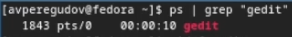

---
## Front matter
title: "Лабораторная работа № 8"
subtitle: "Операционные системы"
author: "Перегудов Александр Вадимович"

## Generic otions
lang: ru-RU
toc-title: "Содержание"

## Bibliography
bibliography: bib/cite.bib
csl: pandoc/csl/gost-r-7-0-5-2008-numeric.csl

## Pdf output format
toc: true # Table of contents
toc-depth: 2
lof: true # List of figures
lot: true # List of tables
fontsize: 12pt
linestretch: 1.5
papersize: a4
documentclass: scrreprt
## I18n polyglossia
polyglossia-lang:
  name: russian
  options:
	- spelling=modern
	- babelshorthands=true
polyglossia-otherlangs:
  name: english
## I18n babel
babel-lang: russian
babel-otherlangs: english
## Fonts
mainfont: PT Serif
romanfont: PT Serif
sansfont: PT Sans
monofont: PT Mono
mainfontoptions: Ligatures=TeX
romanfontoptions: Ligatures=TeX
sansfontoptions: Ligatures=TeX,Scale=MatchLowercase
monofontoptions: Scale=MatchLowercase,Scale=0.9
## Biblatex
biblatex: true
biblio-style: "gost-numeric"
biblatexoptions:
  - parentracker=true
  - backend=biber
  - hyperref=auto
  - language=auto
  - autolang=other*
  - citestyle=gost-numeric
## Pandoc-crossref LaTeX customization
figureTitle: "Рис."
tableTitle: "Таблица"
listingTitle: "Листинг"
lofTitle: "Список иллюстраций"
lotTitle: "Список таблиц"
lolTitle: "Листинги"
## Misc options
indent: true
header-includes:
  - \usepackage{indentfirst}
  - \usepackage{float} # keep figures where there are in the text
  - \floatplacement{figure}{H} # keep figures where there are in the text
---

# Цель работы

Ознакомление с инструментами поиска файлов и фильтрации текстовых данных. Приобретение практических навыков: по управлению процессами (и заданиями), по проверке использования диска и обслуживанию файловых систем.

# Задание

# Теоретическое введение

Здесь описываются теоретические аспекты, связанные с выполнением работы.

Например, в табл. [-@tbl:std-dir] приведено краткое описание стандартных каталогов Unix.

: Описание некоторых каталогов файловой системы GNU Linux {#tbl:std-dir}

| Имя каталога | Описание каталога                                                                                                          |
|--------------|----------------------------------------------------------------------------------------------------------------------------|
| `/`          | Корневая директория, содержащая всю файловую                                                                               |
| `/bin `      | Основные системные утилиты, необходимые как в однопользовательском режиме, так и при обычной работе всем пользователям     |
| `/etc`       | Общесистемные конфигурационные файлы и файлы конфигурации установленных программ                                           |
| `/home`      | Содержит домашние директории пользователей, которые, в свою очередь, содержат персональные настройки и данные пользователя |
| `/media`     | Точки монтирования для сменных носителей                                                                                   |
| `/root`      | Домашняя директория пользователя  `root`                                                                                   |
| `/tmp`       | Временные файлы                                                                                                            |
| `/usr`       | Вторичная иерархия для данных пользователя                                                                                 |

Более подробно про Unix см. в [@tanenbaum_book_modern-os_ru; @robbins_book_bash_en; @zarrelli_book_mastering-bash_en; @newham_book_learning-bash_en].

# Выполнение лабораторной работы

Описываются проведённые действия, в качестве иллюстрации даётся ссылка на иллюстрацию (рис. [-@fig:001]).

Вошёл в систему. (рис. @fig:001)

{#fig:001 width=70%}

Записал в файл file.txt названия файлов, содержащихся в каталоге /etc. Проверил наличие файла и вывел его содержимое. (рис. @fig:002)

{#fig:002 width=70%}

Дописал в этот же файл названия файлов, содержащихся в домашнем каталоге. Вывел его содержимое. (рис. @fig:003, @fig:004)

{#fig:003 width=70%}

{#fig:004 width=70%}

Вывел имена всех файлов из file.txt, имеющих расширение .conf. (рис. @fig:005)

{#fig:005 width=70%}

Записал их в новый текстовой файл conf.txt. (рис. @fig:006)

{#fig:006 width=70%}

Вывел на экран файлы в домашнем каталоге имена которых, начинаются с символа "c". (рис. @fig:007)

{#fig:007 width=70%}

Вывел на экран имена файлов из каталога /etc, начинающиеся
с символа "h" а после сделал это постранично. (рис. @fig:008, @fig:009)

{#fig:008 width=70%}

{#fig:009 width=70%}

Запустил в фоновом режиме процесс, который будет записывает в файл ~/logfile файлы, имена которых начинаются с "log". (рис. @fig:010)

{#fig:010 width=70%}

Проверил задания и наличие файла. Вывел содержимое файла. (рис. @fig:011, @fig:012)

{#fig:011 width=70%}

{#fig:012 width=70%}

Проверил наличие файла logfile, удалил его и проверил результат удаления. (рис. @fig:013)

{#fig:013 width=70%}

Запустил gedit в фоновом режиме и выполнил несколько команд для того чтобы подтвердить отсутствие блокировки. (рис. @fig:014)

{#fig:014 width=70%}

Определил идентификатор процесса gedit с помощью ps. (рис. @fig:015)

{#fig:015 width=70%}

Определил идентификатор процесса gedit с помощью gedit. (рис. @fig:016)

{#fig:016 width=70%}

Выполнил команду для вызова справки о команде kill. (рис. @fig:017, @fig:018)

{#fig:017 width=70%}

{#fig:018 width=70%}

Завершил процесс gedit. (рис. @fig:019)

{#fig:019 width=70%}

Выполнил команду для вызова справки о команде df. (рис. @fig:020, @fig:021)

{#fig:020 width=70%}

{#fig:021 width=70%}

Выполнил команду df. (рис. @fig:022)

{#fig:022 width=70%}

Выполнил команду для вызова справки о команде du. (рис. @fig:023, @fig:024)

{#fig:023 width=70%}

{#fig:024 width=70%}

Выполнил команду du. (рис. @fig:025)

{#fig:025 width=70%}

Выполнил команду для вызова справки о команде find. (рис. @fig:026, @fig:027)

{#fig:026 width=70%}

{#fig:027 width=70%}

Вывел имена всех директорий в домашнем каталоге. (рис. @fig:028)

{#fig:028 width=70%}

# Выводы

В этой лабораторной работе были получены базовые навыки для работы с инструментами поиска файлов и фильтрации текстовых данных. Также были приобретенны практическе навыки по управлению процессами, заданиями, проверке использования диска и обслуживанию файловых систем.

# Контрольные вопросы

1. Какие потоки ввода вывода вы знаете?

stdin, stdout, stderr.

2. Объясните разницу между операцией > и >>.

При использовании > файл перезапишится, при использовании >> вывод добавиться в файл.

3. Что такое конвейер?

Конвейер - механизм, позволяющий связывать несколько команд в последовательность.

4. Что такое процесс? Чем это понятие отличается от программы?

Программа - набор инструкций записанных в файл.
Процесс - экзепляр программы, выполняющийся в оперативной памяти компьютера.

Таким образом, программа одна а процессов этой программы может быть множество и выполняться они будут независимо.

5. Что такое PID и GID?

PID (Process ID) - уникальный числовой идентификатор, присваиваемый каждому запущенному процессу операционной системой.
GID (Group ID) - числовой идентификатор, присваиваемый группе пользователей в операционных системах.

6. Что такое задачи и какая команда позволяет ими управлять?

Задача (job) - Программа запущенная на фоне. Ими можно управлять
с помощью команды jobs.

7. Найдите информацию об утилитах top и htop. Каковы их функции?

Утилиты top и htop являются инструментами мониторинга процессов. Обе утилиты позволяют пользователю просматривать список запущенных процессов, а также информацию о загрузке системы и использовании ресурсов.
Функции: мониторинг системы в реальном времени, поиск и анализ процессов, потребляющих ресурсы, обнаружение проблем с производительностью.

8. Назовите и дайте характеристику команде поиска файлов. Приведите примеры использования этой команды.

find предоставляет мощные возможности поиска файлов и каталогов в файловой системе на основе различных критериев.

Примеры:
find /home/user -name "nothing.txt"
find /tmp -type d -empty
find /etc -type f -mtime -7

9. Можно ли по контексту (содержанию) найти файл? Если да, то как?

Да, это возможно.

Например можно попробовать найти все файлы содержащие строку random string:
find ~ -type f -exec grep "random string" {} +

10. Как определить объем свободной памяти на жёстком диске?

Один из возможных способов использовать команду df -h

11. Как определить объем вашего домашнего каталога?

du -sh ~

12. Как удалить зависший процесс?

kill (PID)

PID - номер зависшего процесса. Один из способов узнать PID процесса - ps | grep (Имя процесса)

# Список литературы{.unnumbered}

::: {#refs}
:::
